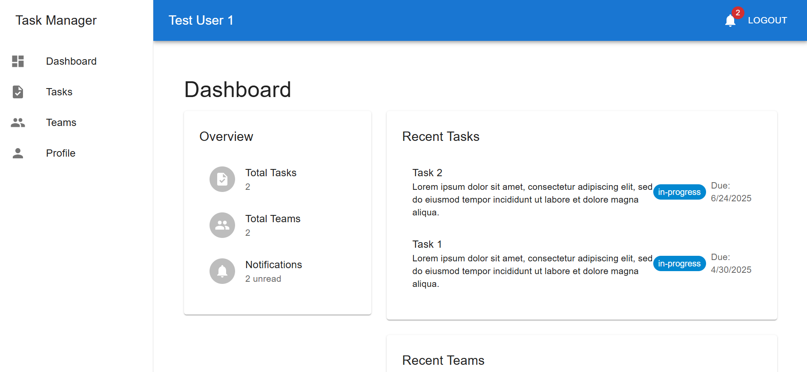

# Collaborative Task Manager App

A full-stack task management application built with the MERN stack (MongoDB, Express.js, React, Node.js).



[](https://mermaid.live/edit#pako:eNqlVd9vmzAQ_leQn7otjSBb0463tX2a1GlSs5eNqfLwjVjBNrLN0izK_76zgY4AIUzzAxx35----2G8J6liQGKS5tSYe04zTUUiA1xeE3wxoIN9pXHrzaPVXGbBE2d9paQC-loQlOd9dYHwW6UHYLTK2zD31EKQasAX-2BbBkFtuv5cw1w0eK9aHhnYR55JYB-3dqU2IC9q6yGR7SxX1GwmZ2m5zQfSZGBSzQvLlewbjaW2NANF0FxpbnfddFkJ7t1Su0Z8-x4gW5_QSrVsK6AisNB0zuvulBAgLW5JK8l0wJqS3u7O1LpbKxfs_yZiuFQPIH74HIUXhvkq_W9sK9Ajvh6sxMfY5HVg6mpOnxF4tmdCTiD_SVn-k6fUFep8aB9EQ8oLjlQHOO2KgV6kStpj91uFVaASoWgb3p8RDbnj6-Tu_DWm4zEczdIzTkiUkODyEoVwPn-Nso8U17vMFNfuqTjl7XhOA67nJg74uF8zGHGwxXN8BvSon7HrFfBfbk-1y9M7XQ5sFOXSDPtGHdprakZBe1Sq5qkXLi7oWLp_Awx7ngpAZiTTnJHY6hJmRIDG6wE_iZ_vhNg14C-DxCgyqjcJSeQB9xRUflVKNNu0KrN181EWDLHry-vFAyQDfadKaUkcXS89BIn35JnE4TzEFYWL5c27xeLqarl8H92Eb2dkh7bDjPz2kWSZ5zMCjONP56G-Jd3r8AfMvhxP)

# GROUP 4(Software Engineering Project)

## Members:

1. BITCO1/2043/2022 - Gavin Maleche 
2. C023/401257/2023 - Ulira Dieudonne 
3. CO23/401208/2023 - Natasha Wambui 
4. C023/401196/2023 - Richard Muhinda               
5. C023/401268/2023 - Vincent Ngisa
6. C023/401239/2023 - Amos Korir 
7. C023/401227/2023 - Kiama Charles


## Features

### User Authentication
- Secure login and registration
- JWT-based authentication
- Protected routes and API endpoints

### Task Management
- Create, read, update, and delete tasks
- Assign tasks to team members
- Set task priorities (Low, Medium, High)
- Set due dates and deadlines
- Track task status (To Do, In Progress, Completed)
- Add comments to tasks
- Receive notifications for task updates

### Team Management
- Create and manage teams
- Add/remove team members
- Assign roles (Admin, Member)
- Team-specific task assignment
- Team member notifications
- Team-based access control

### Dashboard
- Overview of tasks and teams
- Recent tasks and teams
- Task status summary
- Unread notifications count

### Notifications
- Task assignment notifications
- Task status update notifications
- Team invitation notifications
- Task comment notifications

## Tech Stack

### Frontend
- React.js
- Redux Toolkit for state management
- Material-UI for UI components
- Axios for API requests
- React Router for navigation

### Backend
- Node.js
- Express.js
- MongoDB with Mongoose
- JWT for authentication
- Bcrypt for password hashing

## Getting Started

### Prerequisites
- Node.js (v14 or higher)
- MongoDB
- npm or yarn

### Installation

1. Clone the repository:
```bash
git clone <repository-url>
cd task-manager
```

2. Install backend dependencies:
```bash
cd backend
npm install
```

3. Install frontend dependencies:
```bash
cd ../frontend
npm install
```

4. Create a `.env` file in the backend directory:
```env
PORT=5000
MONGODB_URI=mongodb://localhost:27017/taskmanager
JWT_SECRET=your_jwt_secret
```

5. Start the backend server:
```bash
cd backend
npm run dev
```

6. Start the frontend development server:
```bash
cd frontend
npm run dev
```

The application will be available at:
- Frontend: http://localhost:5173
- Backend API: http://localhost:5000

## Project Structure

```
task-manager/
├── backend/
│   ├── controllers/     # Route controllers
│   ├── middleware/      # Custom middleware
│   ├── models/          # Mongoose models
│   ├── routes/          # API routes
│   ├── utils/           # Utility functions
│   └── server.js        # Express server
├── frontend/
│   ├── public/          # Static files
│   ├── src/
│   │   ├── components/  # Reusable components
│   │   ├── features/    # Redux slices
│   │   ├── pages/       # Page components
│   │   ├── utils/       # Utility functions
│   │   └── App.jsx      # Main component
│   └── package.json
└── README.md
```

## API Endpoints

### Authentication
- POST /api/auth/register - Register a new user
- POST /api/auth/login - Login user
- PUT /api/auth/profile - Update user profile

### Tasks
- GET /api/tasks - Get all tasks
- POST /api/tasks - Create a new task
- GET /api/tasks/:id - Get task by ID
- PUT /api/tasks/:id - Update task
- DELETE /api/tasks/:id - Delete task
- POST /api/tasks/:id/comments - Add comment to task

### Teams
- GET /api/teams - Get all teams
- POST /api/teams - Create a new team
- GET /api/teams/:id - Get team by ID
- PUT /api/teams/:id - Update team
- DELETE /api/teams/:id - Delete team
- POST /api/teams/:id/members - Add member to team
- DELETE /api/teams/:id/members - Remove member from team

### Notifications
- GET /api/notifications - Get user notifications
- PUT /api/notifications/:id/read - Mark notification as read
- DELETE /api/notifications/:id - Delete notification

## Contributing

1. Fork the repository
2. Create your feature branch (`git checkout -b feature/amazing-feature`)
3. Commit your changes (`git commit -m 'Add some amazing feature'`)
4. Push to the branch (`git push origin feature/amazing-feature`)
5. Open a Pull Request

